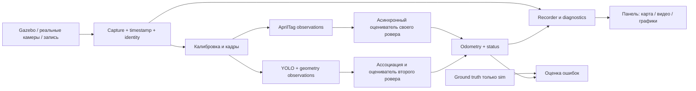

# Архитектура и контракты

> Порядок реализации: сначала S01–S15 (полная система на Gazebo/replay),
> затем H01–H04 (оборудование). Аппаратные требования этого документа действуют
> в H-фазе и не блокируют SIM_ACCEPTED. Частоты, точность, калибровка, панель
> и устойчивость проверяются в SIM-фазе на изображениях симулятора.

## Предлагаемый стек

ROS 2 Jazzy на Ubuntu 24.04; Gazebo Harmonic уже установлен.
Критичный захват/AprilTag/фильтр — C++ там, где профиль показывает пользу.
YOLO — Python-воркер с экспортом в ускоренный runtime после baseline-замеров.
Панель — web-приложение: backend FastAPI + WebSocket, frontend TypeScript/React.
Это исходное решение: перед внедрением проверить текущие версии, совместимость,
лицензию детектора и драйверов, зафиксировать зависимости. Не обновлять системный
стек и GPU-драйвер без технической необходимости.

## Предлагаемые компоненты

`camera_registry`, `capture_adapters`, `time_sync`, `calibration_store`,
`calibration_solver`, `apriltag_observer`, `opponent_observer`, `track_fusion`,
`odometry_publisher`, `recorder`, `evaluation`, `dashboard_backend`, `dashboard_ui`.
Каждый адаптер реализует общий контракт sim/hardware/replay. Сначала сквозной
минимальный путь и измерения, затем оптимизация; не создавать десятки пустых пакетов.

## Время и сообщение наблюдения

Observation содержит camera_id, frame sequence, object/class ID, идентификатор
уникального измерения, capture_timestamp, clock domain, timestamp uncertainty,
exposure duration, receive/processed timestamps, calibration version, pose/XY,
covariance, quality, method и исходные пиксельные признаки.
Общее время измерения — оценённая середина экспозиции; не добавлять половину
выдержки, не выяснив семантику исходной метки драйвера.

Фильтр принимает наблюдения в момент экспозиции, корректно обрабатывает reorder.
Предлагается ограниченное окно 200 мс с восстановлением/переигрыванием состояния;
более старые данные отбрасываются с диагностикой. Публикация прогноза отдельным
таймером; без ожидания полного набора шести кадров.

Синхронные наблюдения одного объекта из разных камер имеют общие ошибки
калибровки: не усреднять ковариации как полностью независимые. В MVP выбрать
лучшую камеру с hysteresis либо консервативное объединение; следующий этап —
явная модель корреляции/совместная оптимизация. Один frame_id нельзя учесть дважды.

Очереди ограничены; для live inference latest-frame-wins. Запись может иметь
свою очередь и сигнализировать drops, но не блокировать оценку движения.
UI получает уменьшенные previews независимо от полноразмерного потока детектора.

## Системы координат

`arena`: фиксированная метрическая система пола.
`camera_N_optical`: x вправо, y вниз, z вперёд.
`friendly/base_link`, `opponent/base_link`: центры роверов с зафиксированными осями.
`T_arena_camera` преобразует координаты camera→arena.
`T_base_tag` преобразует tag→base; тогда
`T_arena_base = T_arena_camera * T_camera_tag * inverse(T_base_tag)`.
Конвенцию рамки детектора AprilTag согласовать с corner ordering и проверить тестом.

Публиковать `/tracking/friendly/odometry`, `/tracking/opponent/odometry`
как `nav_msgs/Odometry`: pose в `header.frame_id=arena`, twist в `child_frame_id`
согласно контракту ROS. При переводе скоростей вращать и ковариацию.
Это глобально привязанная оценка; название сообщения не означает непрерывную
локальную систему `odom`. Не создавать фиктивный `map→odom` без нужды.
При добавлении onboard odometry проектировать отдельный непрерывный odom и
корректирующее преобразование arena→odom; не публиковать два владельца одного TF.

`/tracking/<object>/status`: valid, tracking_state, last_measurement_stamp,
measurement_age_ms, sources, measurement_hz, output_hz, orientation_valid,
calibration_version, session_id и reset_counter.
`/diagnostics`, `/cameras/<id>/image_raw`, `/cameras/<id>/camera_info`,
`/observations/...`, `/evaluation/...` — отдельные потоки.
Симуляционное время из `/clock`; при reset/прыжке назад сбросить историю и сменить session.

## Конфигурация и панель

Версионируемые YAML/JSON: schema_version, arena, devices, capture, lenses,
intrinsics, extrinsics, timing, detectors, filters, UI, recording.
Внешняя калибровка хранится набором на все камеры, с covariance/quality,
исходными наблюдениями, временем, hash, серийниками и режимами кадра.
При применении — validate→stage→atomic swap→ack от всех потребителей.
В одном обновлении нельзя смешивать новые K со старыми extrinsics.

GET state/schema; PATCH staged config; POST validate/apply/rollback;
калибровки — фоновые задания progress/cancel/result. UI не отправляет shell-команды.
Отдельно обрабатывать операции, требующие остановки capture/сброса tracker.
Применение новых extrinsics отмечать разрывом сессии, не маскировать его ускорением.
Сервис на localhost по умолчанию; при доступе из LAN — аутентификация,
валидация uploads и отсутствие root у web-процесса. Udev экспортируется файлом,
привилегированная установка выполняется отдельной явной операцией.

## Наблюдаемость и восстановление

EKF baseline: для своего [x,y,yaw,vx,vy,omega], для второго сначала [x,y,vx,vy].
Проверить model mismatch при резких поворотах; добавить adaptive Q/IMM только
при измеренном выигрыше. Не сглаживать настолько, чтобы скрывать задержку.
Включать неопределённость K, extrinsics, высоты, времени и детекции в R.
На швах использовать прогноз, качество/размер метки и положение в кадре;
не переключаться только по ближайшему центру камеры.

## Дополнение: marker bundles, каналы и переворот

Применить [решения R02/R04/R05](05_research_integration.md).
Обобщить apriltag_observer до интерфейса marker_observer с отдельными backend
AprilTag/ArUco/ChArUco. Исходный backend AprilTag остаётся поддерживаемым.
Добавить marker registry: family/dictionary, ID/board ID, object ID,
T_base_marker, физические размеры и placement (top/bottom/side).

Observation расширить marker_id, bundle_id, pose_6d/validity, attitude_state,
clock uncertainty и измеренным reprojection quality. Идентифицированные маркеры
привязываются по registry, затем проходят геометрический gating. Переворот
обрабатывается SE(3)-преобразованиями, не зеркальным отражением и не сменой знака yaw.
При вырождении проекции оси корпуса выставлять orientation_invalid.

Measurement plane содержит метрические наблюдения; отдельный video plane даёт
исходные/сжатые кадры центральному YOLO и preview. Панорама запрещена как вход
измерительного контура. Covariance измерений не считается независимой между
камерами автоматически. ROI prediction + периодический full-frame поиск —
оптимизация, которая проходит тест повторного обнаружения.

Для второго объекта track existence tentative/confirmed/deleted отделяется от
качества TRACKING/COASTING/LOST. Timeouts в секундах, подтверждения по уникальным
наблюдениям. MOG2 — только необязательная диагностика, не measurement source.
Wheel/IMU резерв подключается через noisy sim sensors как экспериментальный
адаптер, с отдельным DEAD_RECKONING статусом; истинные позы не имитируют датчик.
